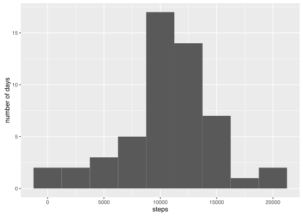

# Reproducible Research: Peer Assessment 1
JIN Xiaoyang  
`r Sys.Date()`  


## Loading and preprocessing the data
load data and transform the second column to Date format

```r
if(!file.exists("activity.csv")) {
    unzip("activity.zip")
}

dat <- read.csv("activity.csv", stringsAsFactors = FALSE)
dat$date = as.Date(dat$date)
dat.clean = dat[complete.cases(dat),]
```

## What is mean total number of steps taken per day?
histogram of the total number of steps taken each day

```r
dat.daysum = aggregate(steps~date, data=dat.clean, sum)
ggplot(dat.daysum, aes(x=date, y=steps)) + geom_bar(stat="identity")
```

<!-- -->

mean number of steps taken per day

```r
mean(dat.daysum$steps)
```

```
## [1] 10766.19
```

median number of steps taken per day

```r
median(dat.daysum$steps)
```

```
## [1] 10765
```

## What is the average daily activity pattern?
the average daily activity pattern

```r
dat.intsum = aggregate(steps~interval ,data=dat.clean, mean)
ggplot(dat.intsum, aes(x=interval, y=steps)) + geom_line()
```

<!-- -->

get the interval containing the maximum number of steps

```r
dat.intsum$interval[which.max(dat.intsum$steps)]
```

```
## [1] 835
```

## Imputing missing values
total number of missing values in the dataset

```r
nrow(dat) - nrow(dat.clean)
```

```
## [1] 2304
```

filling in all of the missing values in the dataset

```r
dat.filled = dat
dat.filled[is.na(dat$steps), "steps"] = round(
    dat.intsum[match(dat[is.na(dat$steps), "interval"],
                     dat.intsum$interval),
               "steps"])
```

histogram of the total number of steps taken each day

```r
dat.filled.daysum = aggregate(steps~date, data=dat.filled, sum)
ggplot(dat.filled.daysum, aes(x=date, y=steps)) + geom_bar(stat="identity")
```

<!-- -->

mean number of steps taken per day

```r
mean(dat.filled.daysum$steps)
```

```
## [1] 10765.64
```

median number of steps taken per day

```r
median(dat.filled.daysum$steps)
```

```
## [1] 10762
```

It shows that these values differ from the estimates from the first part of the assignment. Imputing missing data on the estimates of the total daily number of steps makes the mean and median value smaller.

## Are there differences in activity patterns between weekdays and weekends?

```r
dat.filled$weekdays = factor(format(dat.filled$date, "%u") %in% c('6', '7'),
                             labels = c("weekdays", "weekends"))
dat.filled.intsum = aggregate(steps~interval+weekdays, data=dat.filled, mean)
ggplot(dat.filled.intsum, aes(x=interval, y=steps)) + geom_line() + facet_wrap(~weekdays, nrow=2)
```

<!-- -->

Yes, the patterns between weekdays and weekends are different.
